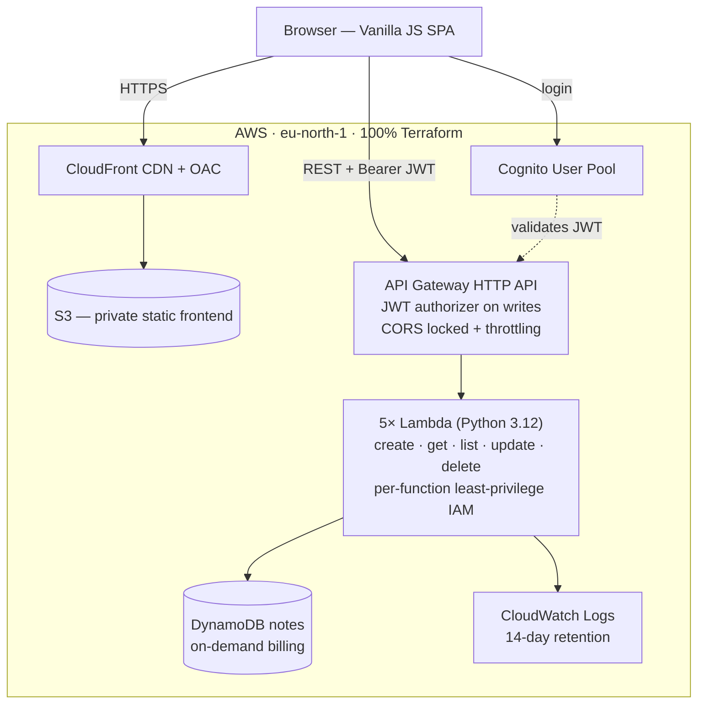
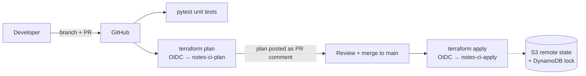
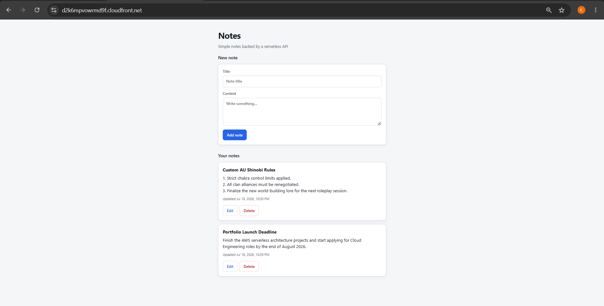
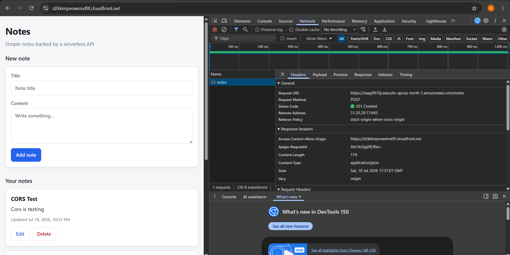
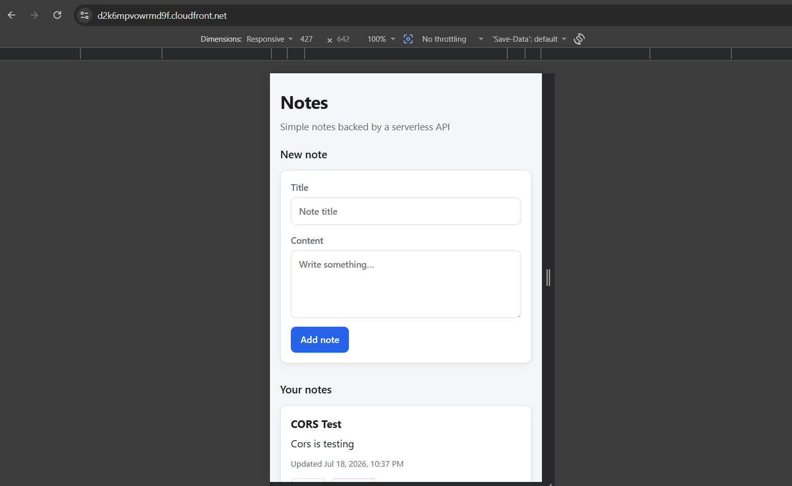
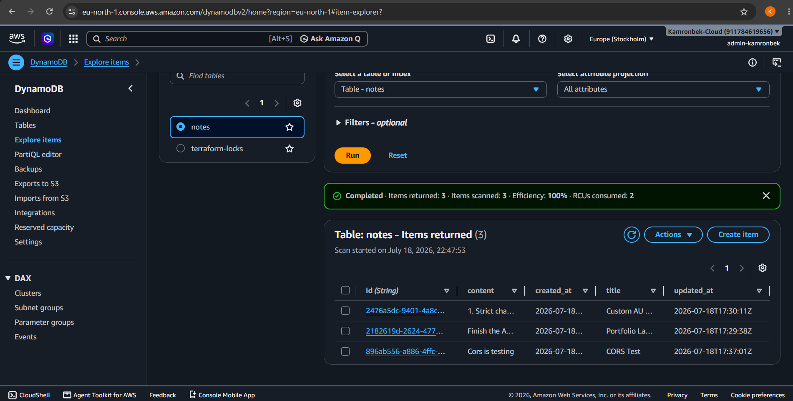
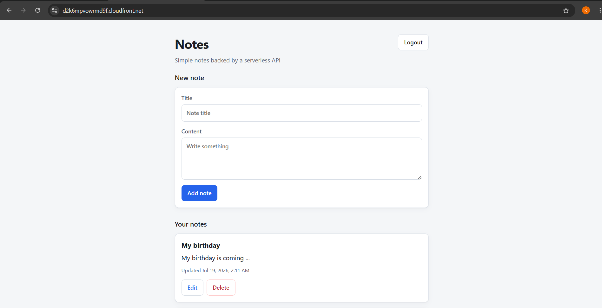

# Serverless Notes App (AWS + Terraform)

[](https://github.com/A-Kamronb3k/serverless-notes-terraform/actions/workflows/ci.yml)
[](./LICENSE)
[](./terraform)

A full-stack, serverless single-page application built and deployed **entirely with Terraform** on AWS — with keyless (OIDC) CI/CD, per-function least-privilege IAM, JWT authentication, and a total running cost of **$0**.

---

## 🏗 Architecture



- **Frontend:** Vanilla JS/HTML/CSS on a **private** S3 bucket, served through CloudFront with Origin Access Control (OAC).
- **Backend:** API Gateway **HTTP API** → five single-purpose Python 3.12 Lambda functions (128 MB, 10 s timeout, no VPC).
- **Database:** DynamoDB (on-demand billing, table `notes`).
- **Auth:** Cognito User Pool with a JWT authorizer on the API — **`GET` routes are public** for easy demo access; **`POST`/`PUT`/`DELETE` require a valid Cognito JWT**.
- **IaC:** Terraform with remote state (S3 + DynamoDB locking), organized into `db`, `api`, `frontend`, `auth`, and `iam` modules.

## 🚀 Live Demo & API

**🌐 Frontend App:** 👉 [https://d2k6mpvowrmd9f.cloudfront.net](https://d2k6mpvowrmd9f.cloudfront.net)

**API Base URL:** `https://zaag9fi70j.execute-api.eu-north-1.amazonaws.com`

Try the public read endpoint right now from your terminal:

```bash
curl https://zaag9fi70j.execute-api.eu-north-1.amazonaws.com/notes
```

Write operations require a Cognito login (use the **Login** button in the app). Full endpoint documentation (routes, payloads, error codes): 👉 **[API Reference (docs/api.md)](./docs/api.md)**

## ⚙️ CI/CD Pipeline (keyless, OIDC)



No long-lived AWS keys exist anywhere in this repository or its CI. GitHub Actions authenticates to AWS via **OIDC federation** using two separate roles:

| Role | Used by | Trust scope | Permissions |
|---|---|---|---|
| `notes-ci-plan` | `terraform plan` on pull requests | this repository | read-only + remote-state access |
| `notes-ci-apply` | `terraform apply` on merge | **`main` branch only** | deploy permissions |

Every pull request gets its Terraform plan posted as a comment for review before merge. Frontend content is deployed with `scripts/deploy-frontend.sh`, which injects the live API URL into `config.js`, syncs to S3, and invalidates the CloudFront cache.

## ✨ Features

- Full CRUD REST API with input validation, structured JSON logging, and consistent error responses (400/404/500)
- Cognito JWT authentication protecting all write operations
- Responsive vanilla-JS SPA with loading, empty, and error states — XSS-safe rendering
- 100% infrastructure as code: nothing was created by hand in the console
- CI/CD: unit tests on every push → `terraform plan` as a PR comment → automatic `apply` on merge to `main`
- **Security highlights:** private S3 buckets behind OAC · per-function IAM (each Lambda can perform exactly one DynamoDB action on one table) · CORS locked to the CloudFront origin · API throttling (burst 10 / rate 20) · keyless deploys

## 🧰 Tech Stack

**AWS:** Lambda · API Gateway (HTTP API) · DynamoDB · S3 · CloudFront · Cognito · IAM · CloudWatch Logs
**Tooling:** Terraform · GitHub Actions (OIDC) · Python 3.12 (boto3) · pytest + moto · Vanilla JS

## 📁 Project Structure

```
terraform/            # root config, backend, providers, variables
  modules/
    db/               # DynamoDB table
    api/              # Lambdas, per-function IAM, API Gateway, JWT authorizer
    frontend/         # S3 + CloudFront (OAC)
    auth/             # Cognito user pool, client, domain
    iam/              # OIDC CI roles (plan / apply)
src/lambdas/          # create.py, get.py, list.py, update.py, delete.py, common.py
frontend/             # index.html, app.js, style.css, config.example.js
tests/
  unit/               # pytest + moto (no AWS account needed)
  integration/        # full CRUD cycle against the live API
  events/             # API Gateway v2 test events for manual invokes
scripts/              # deploy-frontend.sh (config injection + sync + invalidation)
docs/                 # architecture.md, api.md
```

## 📋 Prerequisites

- AWS account + AWS CLI v2 configured with admin credentials (for the initial bootstrap only)
- Terraform ≥ 1.9
- Python 3.12, bash
- A public GitHub repository if you want the CI/CD part

## 🛠 Deploy From Scratch

**1. One-time bootstrap — remote state backend** (the state bucket and lock table must exist before `terraform init`):

```bash
aws s3api create-bucket --bucket <your-tf-state-bucket> --region eu-north-1 \
  --create-bucket-configuration LocationConstraint=eu-north-1
aws s3api put-bucket-versioning --bucket <your-tf-state-bucket> \
  --versioning-configuration Status=Enabled
aws dynamodb create-table --table-name terraform-locks \
  --attribute-definitions AttributeName=LockID,AttributeType=S \
  --key-schema AttributeName=LockID,KeyType=HASH \
  --billing-mode PAY_PER_REQUEST --region eu-north-1
```

**2. Clone and configure:**

```bash
git clone https://github.com/A-Kamronb3k/serverless-notes-terraform.git
cd serverless-notes-terraform
# terraform/backend.tf  -> your state bucket name and key
# terraform/main.tf     -> github_repo ("owner/name"), state_bucket, lock_table_arn
# terraform/variables.tf -> project name (default: serverless-notes)
```

**3. Provision everything:**

```bash
cd terraform
terraform init
terraform plan
terraform apply
```

**4. Deploy the frontend** (injects the real API URL into `config.js`, syncs to S3, invalidates CloudFront):

```bash
cd .. && ./scripts/deploy-frontend.sh
```

**5. Create a demo user** (write operations require login):

```bash
aws cognito-idp admin-create-user --user-pool-id <pool-id> --username demo@example.com
aws cognito-idp admin-set-user-password --user-pool-id <pool-id> \
  --username demo@example.com --password '<StrongPassword1!>' --permanent
```

**6. (Optional) Wire up CI/CD:** in the GitHub repo, add Actions **variables** `PLAN_ROLE_ARN` and `APPLY_ROLE_ARN` (from `terraform output`), then protect `main` (require PRs and the `test`/`plan` checks).

## 🔧 Configuration

| Name | Where | Purpose | Example |
|---|---|---|---|
| `project` | `terraform/variables.tf` | Prefix for all resource names | `serverless-notes` |
| `github_repo` | `terraform/main.tf` (module `iam`) | OIDC trust scope for CI roles | `A-Kamronb3k/serverless-notes-terraform` |
| `TABLE_NAME` | Lambda env (set by Terraform) | DynamoDB table for handlers | `notes` |
| `apiUrl` | `frontend/config.js` (generated by the deploy script — never committed) | API base URL for the SPA | `https://xxxx.execute-api.eu-north-1.amazonaws.com` |

## 🧪 Testing

```bash
pip install -r requirements-dev.txt

# Unit tests — moto-mocked DynamoDB, no AWS account needed (also run in CI on every push)
python -m pytest tests/unit -v

# Integration test — full CRUD cycle against the live API (cleans up after itself).
# Requires a Cognito JWT because write routes are protected:
API_URL=$(cd terraform && terraform output -raw api_endpoint) \
AUTH_TOKEN=<cognito-id-token> \
python -m pytest tests/integration -v
```

Unit tests cover every handler's happy path and error paths (validation failures, missing items, malformed JSON). The integration test skips itself automatically when `API_URL`/`AUTH_TOKEN` are not set.

## 📸 Screenshots

### 1. Application Interface


### 2. Secure API (CORS locked to the CloudFront origin)


### 3. Mobile Responsive Design


### 4. DynamoDB Records


### 5. Cognito Authentication Flow


## 💰 Cost & Free-Tier Notes

This project runs continuously at **$0** by design, not by luck:

| Service | Always-free allowance (monthly) | This project's usage |
|---|---|---|
| Lambda | 1M requests + 400k GB-s | a few hundred requests |
| DynamoDB | 25 GB, on-demand | a few KB |
| CloudFront | 1 TB egress + 10M requests | a few MB |
| S3 / Cognito / IAM | small allowances / free | negligible |

Deliberate cost decisions: **no VPC** for Lambda (avoids NAT Gateway ≈ $33/mo), **on-demand** DynamoDB (no provisioned overage), CloudWatch **log retention 14 days** (the default "never expire" is how free tiers die), **API throttling** (burst 10 / rate 20) so a bot hitting the demo URL can't burn the Lambda free tier, and no Route 53 / ALB / RDS anywhere.

## 📚 Lessons Learned

- **Debug the deployed state, not your source.** A CI OIDC failure (`Not authorized to perform sts:AssumeRoleWithWebIdentity`) survived every "obvious" fix until I started bisecting: inspect the *deployed* trust policy with `aws iam get-role`, compare against a known-good document, change one variable at a time, and decode the actual OIDC token claims instead of guessing them.
- **Make sure your fix actually flows to the resource.** Editing a Terraform variable does nothing if the module doesn't use it — verify the rendered plan, not just the code you touched.
- **DynamoDB returns `Decimal`s** — `json.dumps` crashes on them. A shared response helper with a custom encoder fixed it once, everywhere.
- **CloudFront caching will gaslight you.** Every frontend deploy needs a cache invalidation, or you'll debug "bugs" that are just stale JavaScript.

## 📄 License

MIT — see [LICENSE](./LICENSE).
